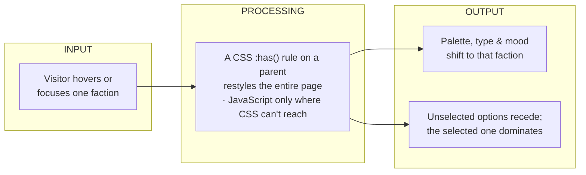
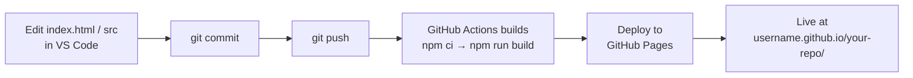

# The Hero Faction Screen

**A starter for Project 1 of AI 201 — Creative Computing with AI (SCAD).**

You are the Art Director. This repo hands you a working, auto-deploying web project so you can spend your energy on the part that matters — **taste** — instead of plumbing. What you'll build is a single-page *hero screen*: an interactive poster that transforms when someone hovers over one of its options.

> ### ▶ Start here
> **[Open the live setup guide →](https://profangrybeard.github.io/Vanilla_Claude/)**
> Five steps from a blank machine to your own live site. Works on **macOS and Windows**; every command is written out for you.
>
> 🌱 **Never used a terminal or Git?** [**LEARN.md**](LEARN.md) is a gentler, at-your-own-pace companion that explains the *why* behind every step.

---

## What you're building

If you've played video games, it's a **character-select screen**. If you haven't, think of it as an **interactive poster** for a movie, a band, or a fashion collection:

> The poster has three to five options. When a viewer hovers on one, the entire poster shifts to reflect that choice — different color palette, different type treatment, different mood. The unselected options recede. The selected option dominates.

That's the whole assignment. One page. No routing, no backend. Three to five options that each feel distinct and worth choosing.

The technical ceiling is deliberately low — because **when the code is easy, the only thing that makes the work *yours* is the taste you bring before the AI starts typing.** You direct; the AI writes; you judge the result against your plan. The full brief lives in [`docs/`](docs/).

---

## The screen you're building

The core idea: the interface doesn't just *list* options — it *performs* them. One hover restyles the **whole page**.



Much of this is achievable in **pure CSS** — look up the `:has()` selector on a parent element before you reach for JavaScript. Your own diagram (a required deliverable) should capture *your* screen's flow: what a visitor does, how your page reacts, and what changes.

## How your work goes live

Every time you push, your site rebuilds and redeploys itself — no manual steps.



The [setup guide](https://profangrybeard.github.io/Vanilla_Claude/) walks you through turning this on for your own copy.

---

## Your deliverables

Beyond the live screen, the project asks for a short paper trail proving *you* directed the work. Collect these in your own README (or sketchbook). Two of them have real, worked examples already in this repo — read them for the shape, then keep your own.

| Deliverable | What it is | Example / help |
|---|---|---|
| **Design Intent** | Your creative spec — palette, type, hover rules, mood — **written before any AI touches your code.** | *You write this.* See the rule below. |
| **System diagram** | A Mermaid flow of *your* screen's input → processing → output. | The diagram above is a reference; adapt it to your screen. |
| **AI Direction Log** | 3–5 short notes: what you asked, what the AI produced, what you kept/changed/rejected and why. | [`claude/ai-direction-log.md`](claude/ai-direction-log.md) |
| **Records of Resistance** | 3 moments you rejected or redirected the AI, and what you did instead. | [`claude/records-of-resistance.md`](claude/records-of-resistance.md) |
| **Five Questions** | A short, honest self-check before you submit. | Listed below. |

> ### ⚠️ The one rule that makes this work
> **Your Design Intent must be your own writing, before you open any AI.** It is the standard you judge every AI suggestion against — so if the AI writes it, nothing in the project is truly yours. An AI-generated Design Intent defeats the assignment. This repo will never hand you a fill-in-the-blank spec, on purpose.

<details>
<summary><b>The Five Questions</b> (answer these before you submit)</summary>

1. **Can I defend this?** Can I explain every major decision in this project?
2. **Is this mine?** Does it reflect my creative direction, or did I mostly follow the AI?
3. **Did I verify?** Did I check that things work the way I think they do?
4. **Would I teach this?** Do I understand it well enough to explain it to someone else?
5. **Is my documentation honest?** Does my AI Direction Log accurately describe what I asked and changed?

</details>

---

## What's in this repo

| Path | What it is |
|---|---|
| [`index.html`](index.html) | The **setup guide** you land on — the file your Hero Screen will eventually replace. |
| [`src/css/styles.css`](src/css/styles.css) · [`src/js/main.js`](src/js/main.js) | Empty starters — where your screen's look and behavior go. |
| [`LEARN.md`](LEARN.md) | A beginner-friendly walkthrough of the whole workflow. |
| [`claude/`](claude/) | Real process docs from building this starter — including two of your example deliverables. |
| [`docs/`](docs/) | The full assignment brief and companion document. |
| [`.github/workflows/deploy.yml`](.github/workflows/deploy.yml) | The auto-deploy pipeline (you don't need to touch it). |

## Run it locally

You'll want [Node.js LTS](https://nodejs.org) and [Git](https://git-scm.com) installed first — the [setup guide](https://profangrybeard.github.io/Vanilla_Claude/) covers that in detail. Then:

```bash
npm install     # once
npm run dev      # start the live preview, then open the printed localhost address
```

Edit, save, and the browser refreshes instantly. When you're ready to go live, `git push` — the rest is automatic.

---

<sub>Built for AI 201, *Creative Computing with AI*, Professor Tim Lindsey · SCAD. The starter, its guide, and its documentation were built with AI assistance and human direction; the creative work of each Hero Screen is the student's own.</sub>
